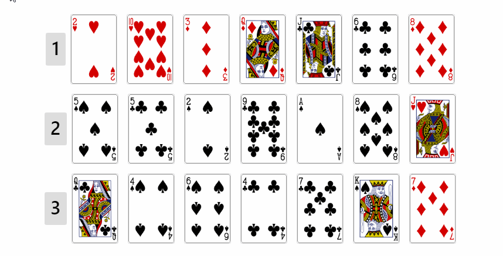
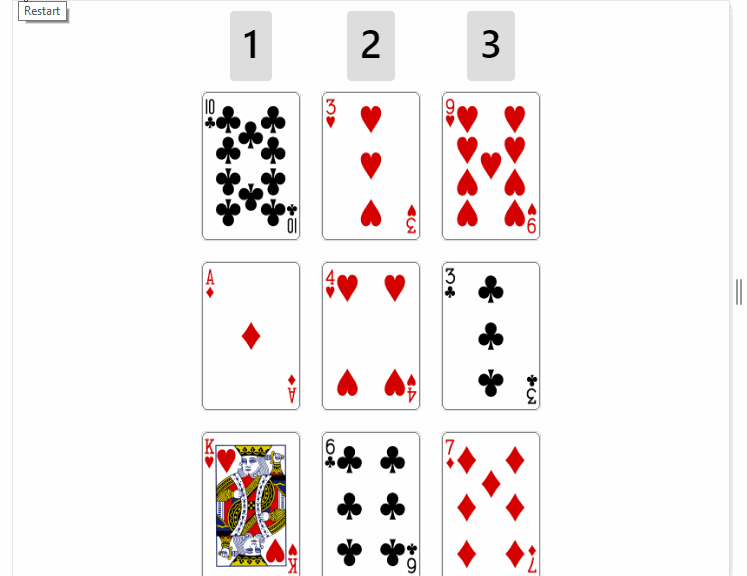

# Web **Trick**

This project try make a magic 
For this you should be choose a card, after click on button where be you card
after 3ª round this app says you which is you card.

The project was made in **REACTJS** with command create-react-app, for tests **JEST** with **ENZYME** package and patterns i used **ESLINT** of airbnb.

# Commands

Inicialize aplication 
```
npm start
```
Install dependecies
```
npm install
```
Run tests
```
npm test
```
# Desktop Screen 
I choose 8HS


# Mobile Screen
I choose 3HS

